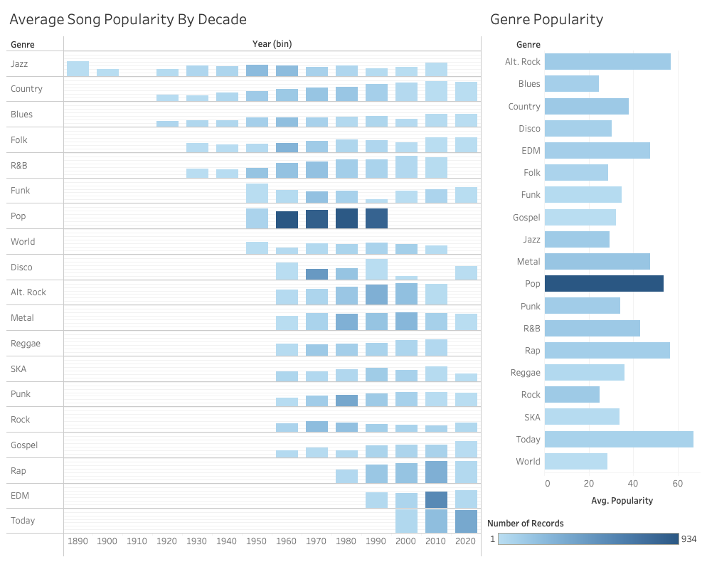
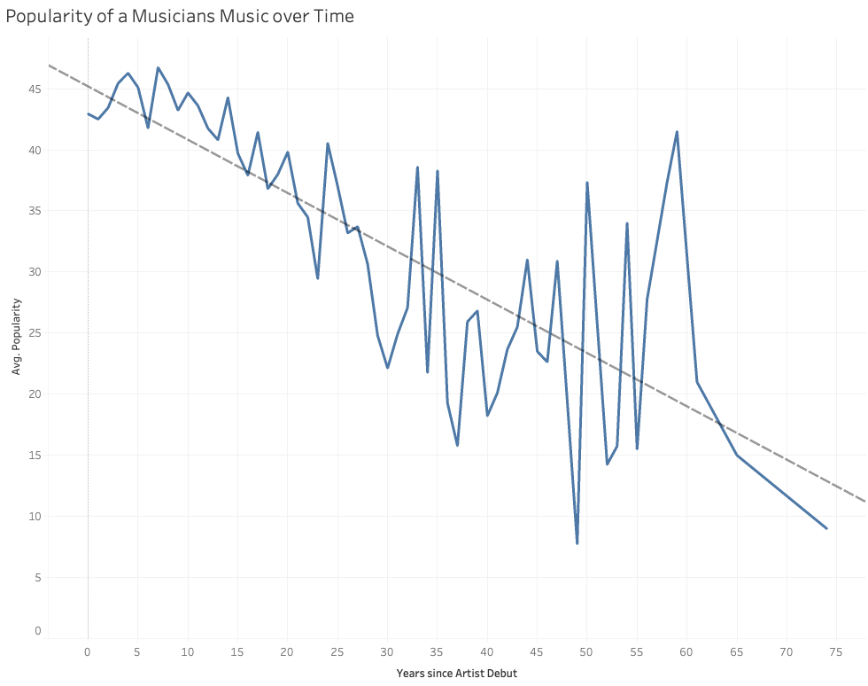

# Summary
## The Data
I found [this](href=https://www.kaggle.com/datasets/thebumpkin/10400-classic-hits-10-genres-1923-to-2023?resource=download>this) dataset on Kaggle the other day, and as a musician, I couldn't resist. In this analysis I will be taking an informed look at the cultural nature of the different genres of music. dataset consisting of some parsed musical features of 15000 tracks of various genres on Spotify. I will be looking at some of this data, and inserting some more personal understanding of Music culture from the standpoint of a musician.
## The Cultural Roots of Music Genre
In a world constantly looking for the "next thing", the time any given piece of music will remain popular seems so very short. But might there be some particular bands or styles which garner the appreciation of listeners over longer periods of time? Well, lets take a look at the data. This dashboard was designed to answer the following question: What time periods are most listened to across different styles?
### The Results

### Interesting Notes
I would like to start with the left chart, because it is really a lot more insightful and interesting than the right. The left chart is a series of bar charts which plot the popularity of the average song from any given decade of music, in any given Genre. An important thing to keep in mind is that these are the popularity indicators related to _todays_ listeners. These are not the relative measures of popularity _in_ the decades, but rather the relative measures of popularity _of_ the decades.

With that in mind, we can now see a lot of the common cultural qualities between genres displayed in this chart. One of the things that I immediately noticed is that the two more musician-oriented styles of Jazz and Blues have relatively even popularity throughout the decades, with Jazz peaking in popularity with its oldest songs. I hypothesize that one of the biggest reasons for this is that both Jazz and Blues music sub-cultures are deeply rooted in traditional "standards", or famous songs. Lots of these standards are collected in books such as the Great American Songbook or The Real Book, and have been re-recorded by numerous famous musicians. Cover playing is more well respected in Jazz (and Blues) than most other styles.

In comparison, other styles which are more oriented to the average listener are not so rooted in the past, and
find a largely positive trend such that newer songs are more likely to be popular than older songs. Such is evidently the case for R&B, Rap, and Country Music. It may be suprising to find a style with such an old history as Country music in this category, but if you take the time to consider it, country may be an older _style_ of playing, but it is not culturally rooted in the playing and re-recording of old classics like Jazz and Blues are.
## How much we prefer "their old stuff"
A well known joke in some music circles is that if someone asks for your opinion on a band you have never heard of, all you need to do is say you "like their old stuff better", and you will almost always get positive response. I thought this would be an interesting thing to test with Python so I wrote a script to do some math. 

Note: I am using a python library called "sqldf" which performs SQL Queries on Pandas DataFrames. It is not exactly "fast" \* , but it is a great choice for ad-hoc one-time operations. I am also starting to learn another tool called DuckDb which looks promising for easily and (somewhat) quickly performing similar computations in the future.
### The Script
```Python
import pandas as pd
import sqldf


df = pd.read_csv("ClassicHit.csv")

artist_info = sqldf.run("""
    SELECT artist, MIN(year) AS artist_start_year, MAX(year) AS artist_end_year, MAX(year)-MIN(year) AS artist_career_length 
        FROM df GROUP BY artist""")

full_df = sqldf.run("""
    SELECT *, (year-artist_start_year) AS years_since_debut 
        FROM df LEFT JOIN artist_info 
            ON df.artist = artist_info.artist""")

if full_df is not None:
    full_df.to_csv("ClassicHit2.csv", index=False)


```

Using the output .csv file from this script, I generate a graph in Tableau which represents the average popularity of an artist over time (grouped by genre).
### The Results

### Interesting Notes
According to this graph, it is in fact the case that listeners tend to prefer the earlier music of the musicians they listen to. But now is a good time to keep in mind that this data is incomplete. On Kaggle, the data is listed as "15,150 classic hits", meaning that this dataset is not representative of all music. These are hits, and that may skew our data one way or the other.
## Conclusion
This dataset is quite rich, and here I only really scratched the surface dealing with time and musician popularity. There is a lot of potential in other areas such as genre prediction and popularity prediction according to Spotify music attributes.


<br><br>

\*In order to execute the sql, sqldf converts the pd.DataFrame to an in-memory sqlite3 database before executing the query on the database and then converting it back to a DataFrame. A fun project for the future might be a sql-to-pandas converter which utilizes an input string of some simplified version of sql to generate the standard pandas syntax (also potential for a nice AI tool here). This would be performance-wise essentially on equal ground with pandas, and it would also be easy to integrate into many existing pandas workflows.
